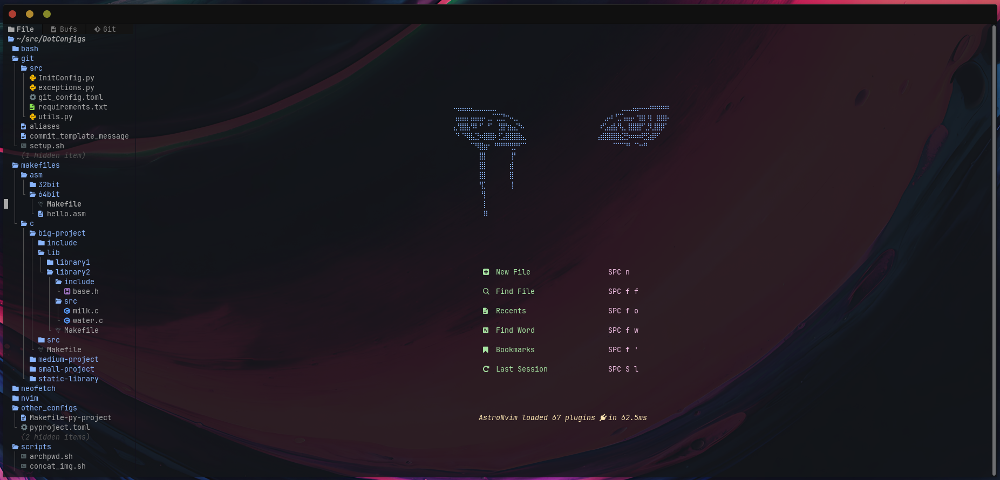
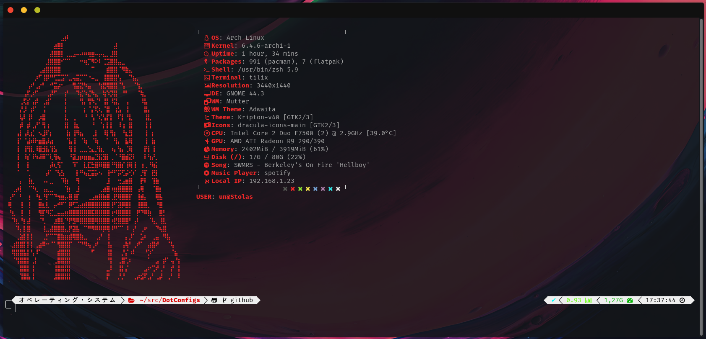

# Qu1nel's DotFiles

This config setup has been tested only on my computer, and there is no guarantee that it will work anywhere else. In any case, if you try to install them and encounter any problems, feel free to open a issue or a pull request.

# Content

- Clang
- GitConfig
- MakeFiles
- Neofetch
- Neovim
- Scripts
- Other
- Tmux
- Vim
- Zsh

## License

[MIT](./LICENSE) © [Ivan Kovach](https://github.com/Qu1nel/)

This Project Qu1nel.DotConfigs in distributive under the **[MIT License](./LICENSE)**, and it also uses those codes that are distributed under the **[MIT License](./LICENSE)**.
