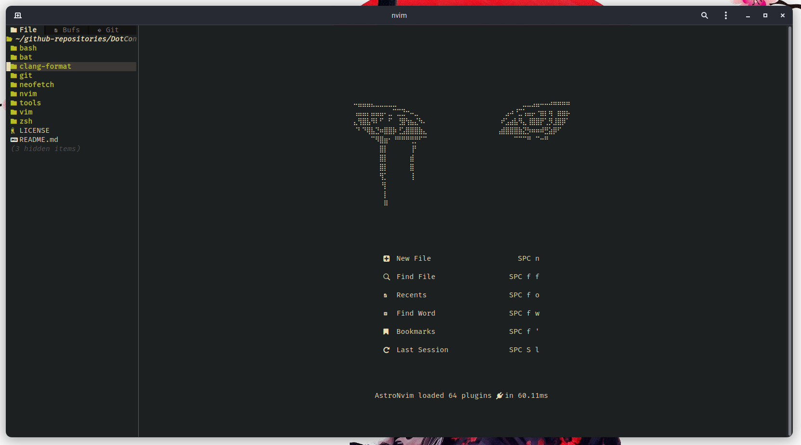
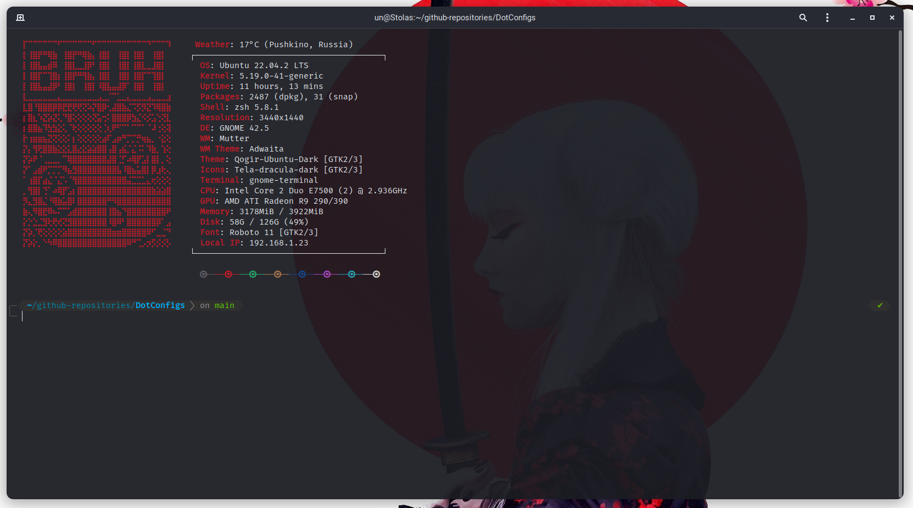
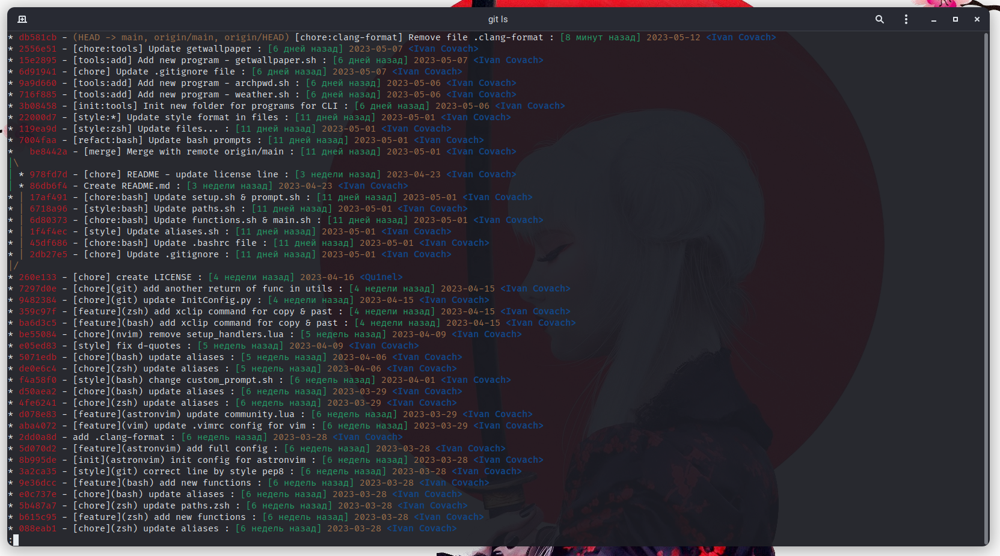

# Qu1nel's doffiles

**Warning**: Don’t blindly use my settings unless you know what that entails. Use at your own risk!

# Content

- vim (NeoVim (AstroNvim))
- git
- bash
- zsh
- neofetch
- bat
- clang-format
- bash scripts (off top)

## License

This software in distributive under the **[MIT License](./LICENSE)**, and it also uses those codes that are distributed under the **[MIT License](./LICENSE)**.
