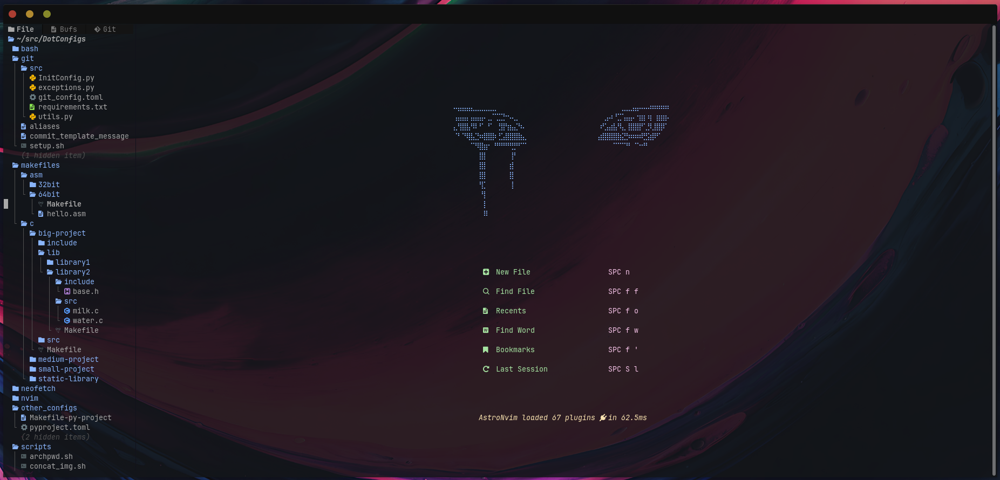
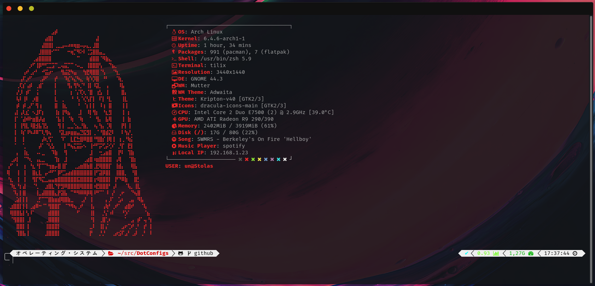

# Qu1nel's DotFiles

## Windows Neovim

The maintained Windows profile provides a right-side file tree, familiar
AstroNvim controls, syntax highlighting and diagnostics for Python, Go, Markdown,
YAML and TOML. The PowerShell installer can prepare Neovim and its dependencies
without Scoop, and supports configuration backups and restore.

See [installation and controls](nvim/README.md) and
[contribution checks](CONTRIBUTING.md).

The other configurations below are the earlier Unix setup.

This config setup has been tested only on my computer, and there is no guarantee that it will work anywhere else. In any case, if you try to install them and encounter any problems, feel free to open a issue or a pull request.

# Content

- Clang
- GitConfig
- MakeFiles
- Neofetch
- Neovim
- Scripts
- Other
- Tmux
- Vim
- Zsh

## License

[MIT](./LICENSE) © [Ivan Kovach](https://github.com/Qu1nel/)

This Project Qu1nel.DotConfigs in distributive under the **[MIT License](./LICENSE)**, and it also uses those codes that are distributed under the **[MIT License](./LICENSE)**.
